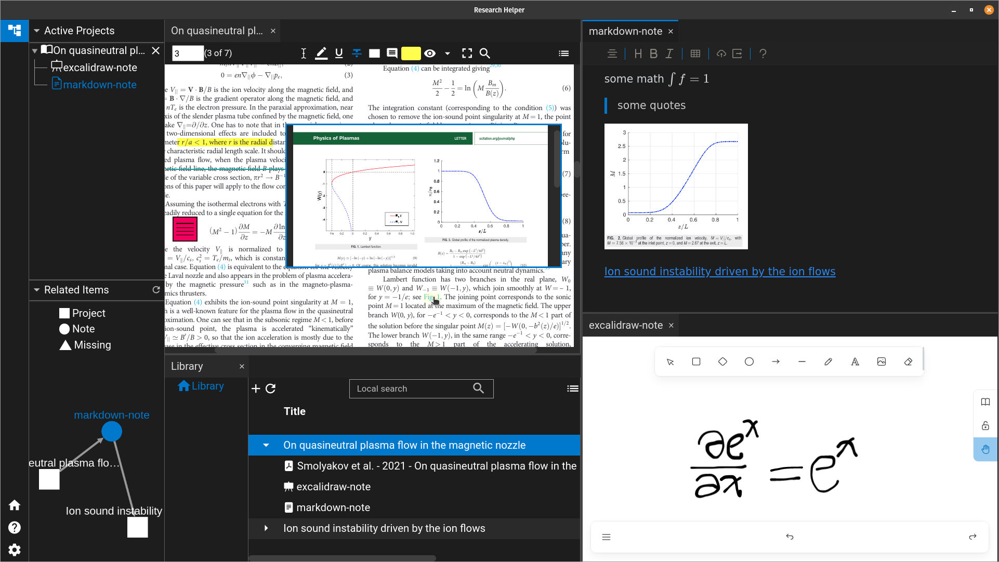
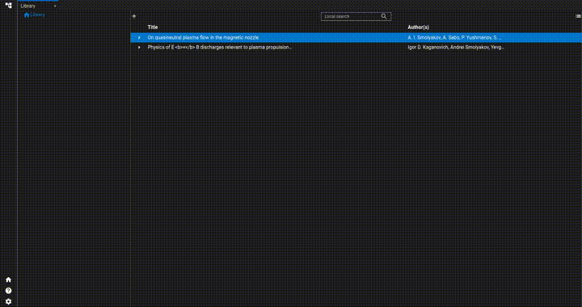

<p align="center">

</p>

<p align="center">
<a href="https://github.com/ResearchHelper/research-helper/blob/main/README.md">English</a>
|
<a href="https://github.com/ResearchHelper/research-helper/blob/main/README.zh_CN.md">中文</a>
</p>

# Research Helper

Research helper is a paper/book management tool. It is a reference management tool with various useful functionalities such as: built-in PDF reader and live markdown.



# Demo



# Contribute to Research-Helper

Research Helper uses [QUASAR](https://quasar.dev) as framework. In this project, the combination of [Vue.js3](https://vuejs.org) and [Electron](https://www.electronjs.org) is used.

## Install the dependencies

```bash
yarn # strongly recommanded
# or
npm install
```

## Start the electron app in development mode (hot-code reloading, error reporting, etc.)

```bash
yarn dev # start electron app in development mode
yarn build # build the app with debugger
```

# Acknowledgement

This project is made possible by the following open source projects.

- Quasar
- Electron
- Vue.js
- citation-js
- cytoscape
- golden-layout
- katex
- pdf.js
- vditor
- Pouchdb

# License

This project uses AGPL license.
