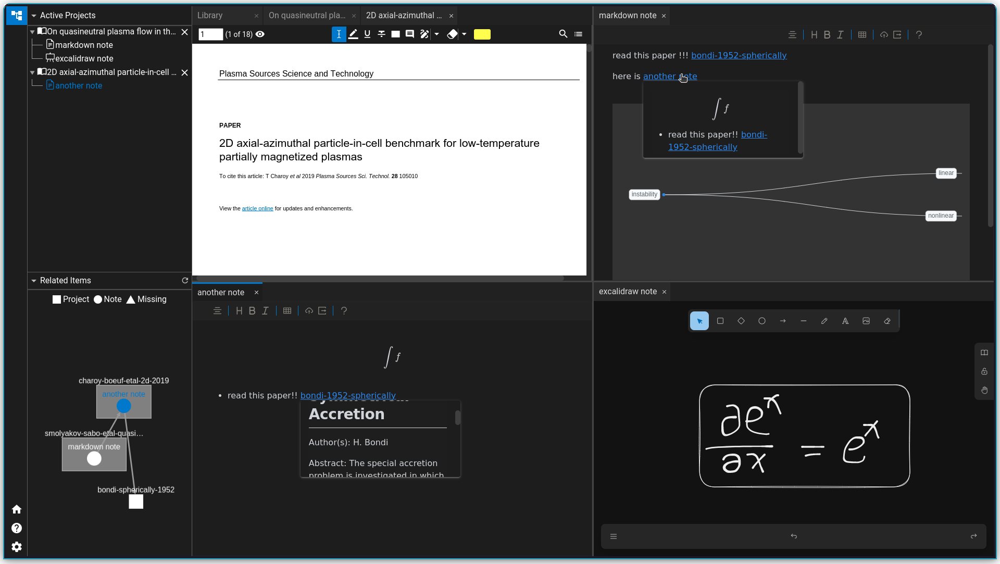

<p align="center">

<br>
<h2 align="center">Accelerate Your Research</h2>
<br>
<a title="Build Status" target="_blank" href="https://github.com/ResearchHelper/research-helper/actions"></a>
<a title="Release" target="_blank" href="https://github.com/ResearchHelper/research-helper/releases"></a>
<a title="Downloads" target="_blank" href="https://github.com/ResearchHelper/research-helper/releases"></a>
<a title="Stars" target="_blank" href="https://github.com/ResearchHelper/research-helper"></a>
<a title="Commits" target="_blank" href="https://github.com/ResearchHelper/research-helper/commits/main"></a>
<br>
<a title="Twitter" target="_blank" href="https://twitter.com/Reseach_Helper"></a>
<a title="QQ" target="_blank" href=""></a>
<a title="Discord" target="_blank" href="https://discord.gg/GQNATNqWkM"></a>
</p>

<p align="center">
<a href="https://github.com/ResearchHelper/research-helper/blob/main/README.md">English</a>
|
<a href="https://github.com/ResearchHelper/research-helper/blob/main/README.zh_CN.md">中文</a>
</p>

# Research Helper

Research helper is a paper/book management tool. It is a reference management tool with various useful functionalities such as: built-in PDF reader, live markdown note and excalidraw note.

## Reference Management

References can be managed in library page.
- Favorites, folders, tags, search, etc. All essential functions are there
- Able to one-click-retrieve meta information and related reference by providing identifier such as DOI
  

## PDF Reader

Research helper has a built-in PDF reader.  
- Able to adjust page layout, light/dark mode and more
- Support markdown comment (also latex) in annotations
- Able to preview internal links in hover windows
  

## Note-taking System

Due to the flexible multi-window layout, it is never this easy to take notes while reading.
- Support WYSIWYG markdown note and excalidraw note
- Able to cite other references/notes in markdown note
- Support math(latex), code block, mindmap and more in markdown down 
  

# Contribute to Research-Helper

Research Helper uses [QUASAR](https://quasar.dev) as framework. In this project, the combination of [Vue.js3](https://vuejs.org) and [Electron](https://www.electronjs.org) is used.

## Install the dependencies

```bash
yarn # strongly recommanded
# or
npm install
```

## Start the electron app in development mode (hot-code reloading, error reporting, etc.)

```bash
yarn dev # start electron app in development mode
```

## To build the app
```bash
yarn build # build the app
# or 
yarn debug # build the app with debugger 
```

## Tests
```bash
yarn test:unit:ci # backend unit test
yarn test:component:ci # vue component test
```

# Acknowledgement

This project is made possible by the following open source projects.

- Quasar
- Electron
- Vue.js
- citation-js
- cytoscape
- golden-layout
- pdf.js
- vditor
- Pouchdb
- Excalidraw

# License

This project uses AGPL license.
