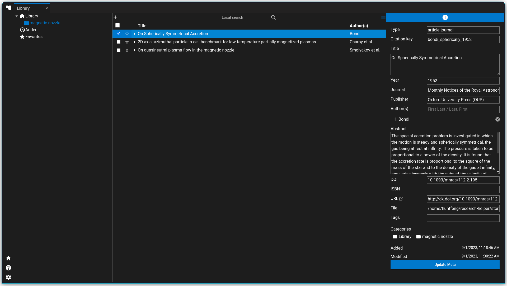
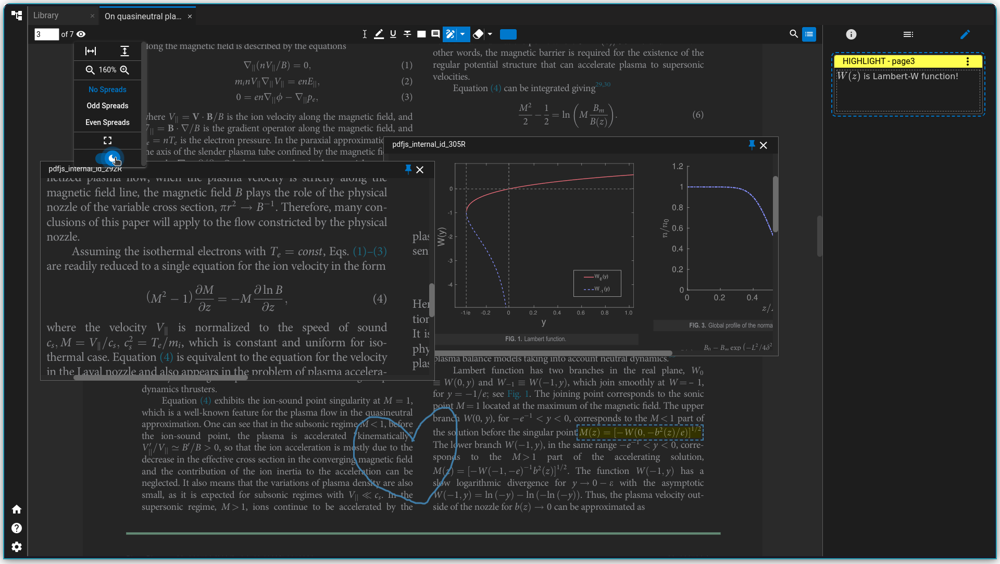
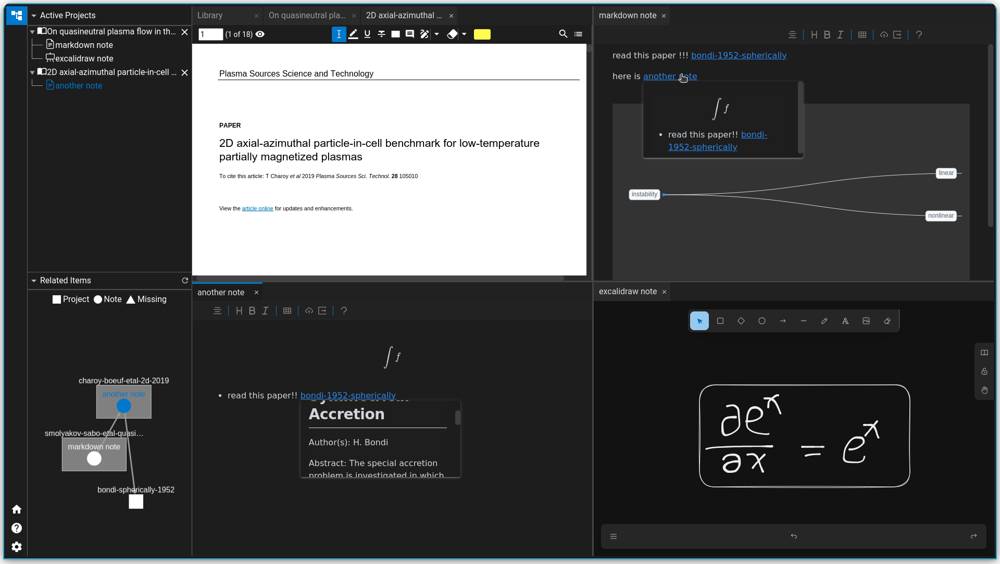

<p align="center">

<br>
<h2 align="center">Accelerate Your Research</h2>
<br>
<a title="Build Status" target="_blank" href="https://github.com/ResearchHelper/research-helper/actions"></a>
<a title="Release" target="_blank" href="https://github.com/ResearchHelper/research-helper/releases"></a>
<a title="Downloads" target="_blank" href="https://github.com/ResearchHelper/research-helper/releases"></a>
<a title="Stars" target="_blank" href="https://github.com/ResearchHelper/research-helper"></a>
<a title="Commits" target="_blank" href="https://github.com/ResearchHelper/research-helper/commits/main"></a>
<br>
<a title="Twitter" target="_blank" href="https://twitter.com/Reseach_Helper"></a>
<a title="QQ" target="_blank" href=""></a>
<a title="Discord" target="_blank" href="https://discord.gg/GQNATNqWkM"></a>
</p>

<p align="center">
<a href="https://github.com/ResearchHelper/research-helper/blob/main/README.md">English</a>
|
<a href="https://github.com/ResearchHelper/research-helper/blob/main/README.zh_CN.md">中文</a>
</p>

# 小助手正式版 [Sophosia](https://github.com/sophosia/sophosia) 已经发布了哦！

感谢大家对小助手的支持，在 2023 这一年里，我收到了很多有用的建议，研究小助手的 beta 版已经完成了它的使命，今后不会再有新功能的发布了。小助手正式版[Sophosia](https://github.com/sophosia/sophosia)将会是我以后持续更新的版本。正式版与测试版最大的不同有两点是：

1. 正式版去掉了 PouchDB 数据库，所有的数据都是以文本为中心的。
2. 正式版采用了 Tauri 而非 Electron。

这样做的好处有几点：

1. 无数据库使得用户可以使用自己喜欢的同步工具进行同步了。
2. 以文本为中心使得用户可以选择使用自己喜欢的文本编辑器写笔记，不用担心不同软件之间的数据一致性问题了。
3. 正式版变得非常轻量(~15MB)。

希望大家能继续支持小助手哦！

# 研究小助手

研究小助手是一款开源的文献管理工具。它有着内置的 PDF 阅读器，所见即所得的 Markdown 编辑器以及 Excalidraw 画板。你可以很好地用它来管理自己的电子书，文献以及笔记。

## 文献管理

你可以在书库页面管理你的文献。

- 收藏、分类、标签、搜索，基本功能一应俱全
- 能根据 DOI 等信息一键获取该文献的详细信息以及相关文献
  

## 文献阅读

自带的 PDF 阅读器能够让你浏览你的文献。

- 可调节页面布局、明暗模式、全屏模式等
- 注释支持 markdown 格式,以及 latex 语法
- 内部链接可在悬浮窗预览，轻松查看公式与图表
  

## 笔记系统

得益于多窗口布局，阅读文献的同时记笔记是如此轻松

- 笔记分为所见即所得的 markdown 笔记以及自由画板的 excalidraw 笔记两种类型
- markdown 笔记能轻松引用别的文献或笔记
- markdown 笔记支持数学公式、代码块、思维导图等的渲染
  

# 为研究小助手作贡献

研究小助手用[QUASAR](https://quasar.dev)作为框架。这款软件采用了[Vue.js3](https://vuejs.org)加[Electron](https://www.electronjs.org)的组合。

## 安装依赖

```bash
yarn # 推荐用yarn
# 或者
npm install
```

## 开始开发吧

```bash
yarn dev # electron 开发模式
```

## 编译

```bash
yarn build # 编译发行版
# 或者
yarn debug # 编译带着debugger的测试版
```

## 测试

```bash
yarn test:unit:ci # 后端单元测试
yarn test:component:ci # 前端Vue Component测试
```

# 致谢

没有以下的开源项目就没有这款软件

- Quasar
- Electron
- Vue.js
- citation-js
- cytoscape
- golden-layout
- pdf.js
- vditor
- Pouchdb
- Excalidraw

# 许可证

本项目采用了 AGPL 许可证。
